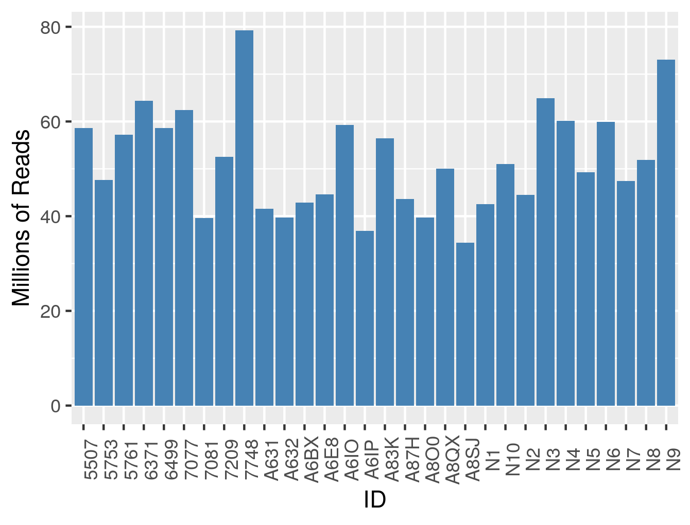
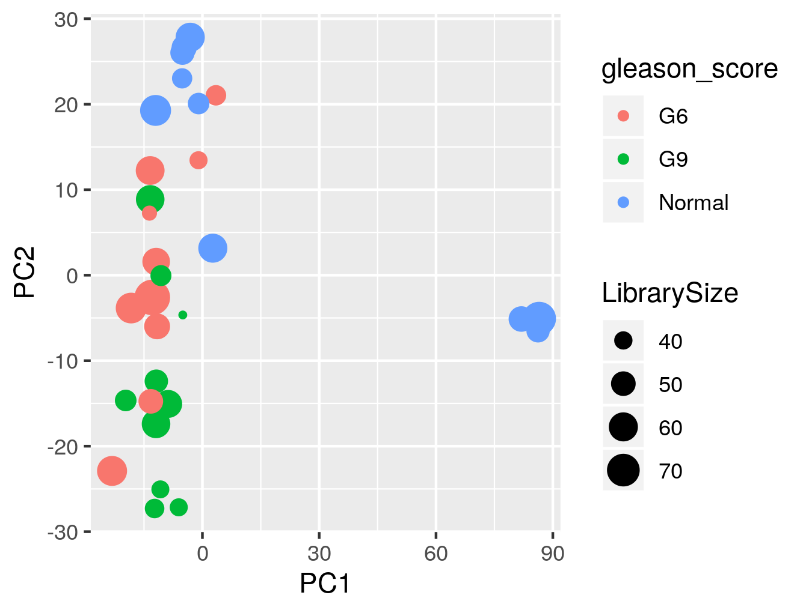

**Original Authors: Belinda Phipson, Anna Trigos, Matt Ritchie, Maria Doyle, Harriet Dashnow, Charity Law**, **Stephane Ballereau, Oscar Rueda, Ashley Sawle**
Based on the course [RNAseq analysis in R](http://combine-australia.github.io/2016-05-11-RNAseq/) delivered on May 11/12th 2016 and modified by Cancer Research Uk Cambridge Centre for the [Functional Genomics Autumn School 2017](https://bioinformatics-core-shared-training.github.io/cruk-autumn-school-2017/)

```{r knitrOpts, include=FALSE}
knitr::opts_chunk$set(echo = TRUE)
```


## Resources and data files

This material has been created using the following resources:  


- http://monashbioinformaticsplatform.github.io/RNAseq-DE-analysis-with-R/99-RNAseq_DE_analysis_with_R.html  
- http://bioconductor.org/packages/devel/bioc/vignettes/DESeq2/inst/doc/DESeq2.html
- https://bioconductor.github.io/BiocWorkshops/rna-seq-data-analysis-with-deseq2.html


## Overview

* Reading in table of counts
* Filtering lowly expressed genes
* Quality control
* Normalisation for composition bias


## Introduction

Measuring gene expression on a genome-wide scale has become common practice over the last two decades or so, with microarrays predominantly used pre-2008. With the advent of next generation sequencing technology in 2008, an increasing number of scientists use this technology to measure and understand changes in gene expression in often complex systems. As sequencing costs have decreased, using RNA-Seq to simultaneously measure the expression of tens of thousands of genes for multiple samples has never been easier. The cost of these experiments has now moved from generating the data to storing and analysing it.

There are many steps involved in analysing an RNA-Seq experiment. Analysing an RNAseq experiment begins with sequencing reads. Traditionally, these are aligned to a reference genome, then the number of reads mapped to each gene can be counted. More modern approaches such as `salmon` quantify transcripts directly and do not require genome aligment  to have taken place. Either approach results in a table of counts, which is what we perform statistical analyses on in R. While mapping and counting are important and necessary tasks, this session will be starting from the count data and getting stuck into analysis.

We will be following a workflow that uses the `DESeq2` package. An alternative and well-respected workflow is based on the [edgeR and limma packages](https://bioconductor.github.io/BiocWorkshops/rna-seq-analysis-is-easy-as-1-2-3-with-limma-glimma-and-edger.html).

### The TCGA datasets

The data for this tutorial comes from a Bioinformatics paper, [*Alternative preprocessing of RNA-Sequencing data in The Cancer Genome Atlas leads to improved analysis results*](https://academic.oup.com/bioinformatics/article/31/22/3666/240143) where the authors re-analysed published TCGA data using an alternative pipeline. Crucially they made available raw counts that we will use to demonstrate full the RNA-seq processing pipeline from raw counts.

The raw counts for tumours and normals are available on [GEO](https://www.ncbi.nlm.nih.gov/geo/query/acc.cgi?acc=GSE62944). A selection of prostate tumours with Gleason grade 6 and 9, and normals were selected to give a realistic dataset.

## Importing the metadata and counts

Although RNA-seq datasets generate large amounts of data, once the preliminary steps of *alignment* and *counting* have been performed that data are small enough that we can comfortably handle them on a standard laptop or desktop using R. 

The raw counts for this dataset can be found in the file `"selected_prostate_tcga_raw.tsv"`. It is a good idea to keep your analysis project organised, with the raw and processed data usually found in separate folders. In our case, the counts are found in the folder `raw_data`. When importing the data we have to specify a *path*. If in doubt, the function `file.exists` can be used to see if we have specified a valid path. At this stage we don't need to use any specialised packages to read the data into R, so `read_tsv` will do.  The data can be inspected using `head`

```{r message=FALSE}
library(tidyverse)
file.exists("raw_data/selected_prostate_tcga_raw.tsv")
raw <- read_tsv("raw_data/selected_prostate_tcga_raw.tsv")
head(raw)
```

In the data frame we have created each row represents a gene, and the columns correspond to different biological samples. The numbers represent the counts for each gene in every sample. i.e. the number of reads that overlap with that gene. For analysis we will need to convert into a *matrix* containing only numerical data and label each row with a gene name. The convenient `pull` function is used to extract a column from a tidy data frame.

```{r}
genes <- pull(raw,X)
cts <- as.matrix(raw[,-1])
rownames(cts) <- genes

```

The count matrix we have generated is not particularly useful on it's own. We need to collect data on which biological groups each sample belongs to, along with any other relevant *metadata* or clinical variables.

The `sampleInfo.txt` in the `meta_data` folder contains basic information about the samples that we will need for the analysis today. This includes the TCGA ID, a shortened patient ID and the gleason grade.

```{r loadSampleInfo}
# Read the sample information into R
sampleinfo <- read.delim("meta_data/sampleInfo.tsv")
View(sampleinfo)
```


## Quality control of the counts

We will be using the `DESeq2` library to analyse this dataset. As part of the [DESeq2 vignette](http://bioconductor.org/packages/devel/bioc/vignettes/DESeq2/inst/doc/DESeq2.html) you will see examples of importing count data from different sources. In all cases, [raw count data are expected](http://bioconductor.org/packages/devel/bioc/vignettes/DESeq2/inst/doc/DESeq2.html#why-un-normalized-counts). We will use the `DESeqDataSetFromMatrix` function which is applicable to how the data have been processed.

The function requires the counts and sample information to be specified along with a *design* for the experiment. This will define how the differential expression analysis is carried out, but can be changed at a later stage so we will use `Status` for now as our factor of interest.

```{r message=FALSE}
library(DESeq2)
  dds <- DESeqDataSetFromMatrix(countData = cts, 
                                colData = sampleinfo,
                                design = ~Status)
```

The object contains all the metadata for the experiment, along with the counts. 

```{r}
dds
```

```{r}
colData(dds)
```


### Visualising library sizes

We can look at a few different plots to check that the data is good quality, and that the samples are as we would expect. First, we can check how many reads we have for each sample in the `DESeqDataSet`. The counts themselves are accessed using the `assay` function; giving a matrix of counts. The sum of a particular column is therefore the total number of reads for that sample.

```{r}
sum(assay(dds)[,1])
```

A convenience function `colSums` exists for calculating the sum of each column in a matrix, returning a `vector` as a result.

```{r dgeLibrarySizes}
colSums(assay(dds))

```


> ## Challenge 1 {.challenge}
>
>  Produce a bar plot to show the Millions of reads for each sample
>  See below for an example





### Filtering non-expressed genes

The dataset is usually filtered at this stage to remove any genes that are not expressed. Although not strictly required for the DESeq2 differential expression algorithm, it can reduce the time and memory required to perform some of the analysis. Let's say that for a gene to be "expressed" in a particular sample we need to see 5 or more counts  


```{r}
is_expressed <- assay(dds) >= 5

```

R is happy to think of logical values (`TRUE` or `FALSE`) as the integers `0` or `1`. Therefore if we calculate the sum across a particular row it will give the number of samples that gene is expressed in.

```{r}
sum(is_expressed[1,])
sum(is_expressed[2,])

```

In a similar manner to `colSums`, `rowSums` will give the sum of each row in a matrix and return the result as a `vector`.

```{r}
df <- data.frame(Expressed = rowSums(is_expressed))
ggplot(df, aes(x=Expressed)) + geom_bar()
```

It seems that genes are either expressed in all samples, or not expressed at all. We will decide to keep genes that are expressed in at least 2 samples.

```{r}
keep <- rowSums(assay(dds) >= 5) >= 5
table(keep)
dds <- dds[keep,]

```

### Visualising count distributions

We typically use a `boxplot` to visualise difference the distributions of the columns of a numeric data frame. Applying the `boxplot` function to the raw counts from our dataset reveals something about the nature of the data; the distributions are dominated by a few genes with very large counts.

N.B we will use the `boxplot` function from "base" R as it provides a more convenient way of quickly creating boxplots from a matrix of numeric values.

```{r}
boxplot(assay(dds))
```

A log$_10$ (for example) transformation can be used to display the counts on a more convenient scale for visualisation

```{r message=FALSE}
boxplot(log10(assay(dds)))
```


 We can use the `vst` or `rlog` function from `DESeq2`to compensate for the effect of different library sizes and put the data on the log$_2$ scale. The effect is to remove the dependence of the variance on the mean, particularly the high variance of the logarithm of count data when the mean is low. For more details see the [DESeq2 vignette](http://bioconductor.org/packages/devel/bioc/vignettes/DESeq2/inst/doc/DESeq2.html#count-data-transformations)


```{r}
# Get log2 counts
vsd <- vst(dds,blind=TRUE)
# Check distributions of samples using boxplots
boxplot(assay(vsd), xlab="", ylab="Log2 counts per million",las=2,main="Normalised Distributions")
# Let's add a blue horizontal line that corresponds to the median logCPM
abline(h=median(assay(vsd)), col="blue")
```

### Heatmap of the sample-to-sample distances

Another use of the transformed data is sample clustering. Here, we apply the `dist` function to the **transpose** of the transformed count matrix to get sample-to-sample distances.


```{r}
sampleDists <- dist(t(assay(vsd)))
```

A heatmap of this distance matrix gives us an overview over similarities and dissimilarities between samples. By re-naming the rows and columns of the distance matrix we can make the plot easier to interpret.

```{r}
library(RColorBrewer)
library(pheatmap)
sampleDistMatrix <- as.matrix(sampleDists)
rownames(sampleDistMatrix) <- colData(dds)$ID
colnames(sampleDistMatrix) <- colData(dds)$ID
colors <- colorRampPalette( rev(brewer.pal(9, "Blues")) )(255)


pheatmap(sampleDistMatrix,
         col=colors)
```


### Principal component analysis (PCA) 

Related to the distance matrix heatmap is the [(Principal Components Analysis) PCA](http://setosa.io/ev/principal-component-analysis/) plot, which shows the samples in the 2D plane spanned by their first two principal components. A principle components analysis is an example of an unsupervised analysis, where we don’t need to specify the groups. If your experiment is well controlled and has worked well, what we hope to see is that the greatest sources of variation in the data are the treatments/groups we are interested in. It is also an incredibly useful tool for quality control and checking for outliers

`DESeq2` has a convenient `plotPCA` function for making the PCA plot, which makes use of the `ggplot2` graphics package. Conveniently it will plot points according to a particular column in the metadata.

```{r}
plotPCA(vsd,intgroup=c("Status"))
```

> ## Challenge 2 {.challenge}
>
> 1. Is the `plotPCA` plot based on all genes in the dataset? How can we change how many genes are used for the PCA analysis? Does this significantly change the plot? (HINT: check the documentation for the `plotPCA` function.)
> 2. Change the `intgroup` parameter so that both gleason_score and Status are used for grouping. (See the documentation again)
> 3. What potential problems can you spot in the data?

### Note about batch effects

In our unsupervised analysis we should see that the main source of variation is due to biological effects, and not technical variation such as when the libraries were sequenced. If we do observe high technical variation in our data, it is not a complete disaster provided that ***we have designed our experiment properly**. In particular the [sva Bioconductor package](https://bioconductor.org/packages/release/bioc/vignettes/sva/inst/doc/sva.pdf) can correct for batch effects provided that representatives of the groups of interest appear in each batch. Alternatively, the batch or confounding factor may be incorporated into the differential expression analysis.

### Correcting the sample information


The person creating the sample sheet has been inconsistent about the way that values of `gleason_score` have been entered into the metadata. Such errors can be annoying when labelling plots, but have more serious consequences when attempting to fit statistical models to the data.

```{r}
dplyr::count(sampleinfo,gleason_score)
```


```{r correctSampleSheet}
library(stringr)
sampleinfo_corrected <- sampleinfo

sampleinfo_corrected <- mutate(sampleinfo, gleason_score = str_to_title(gleason_score)) %>%
  mutate(gleason_score = str_trim(gleason_score)) 

dplyr::count(sampleinfo_corrected,gleason_score)

write.table(sampleinfo_corrected, file="meta_data/sampleInfo_corrected.txt",sep="\t",row.names = FALSE)
```

> ## Challenge 3 {.challenge}
>
> 1. Re-create the DESeqDataset object to include the corrected sample information
> 2. Re-run the plotPCA function on the new data and verify that the sample groups now look correct
>


### A note about "pipes" and ggplot2


The `plotPCA` function produces a `ggplot2` plot (rather than "base" graphics) and we can also get the function to return the data used to create the plot by changing the `returnData` argument.

```{r}
plot_data <- plotPCA(vsd,intgroup="Status",returnData=TRUE)
plot_data <- bind_cols(plot_data,sampleinfo_corrected)
```

With `ggplot2` plot can be created by mapping various *aesthetics* of the plot (colour, shape, x- and y-coordinates) to columns in the data frame.

```{r}
library(ggplot2)
ggplot(plot_data, aes(x = PC1,y=PC2, col=Status)) + geom_point()
```

Having the data in this form allows us to customise the plot in lots of ways

```{r}
ggplot(plot_data, aes(x = PC1,y=PC2, col=Status,pch=gleason_score)) + geom_point(size=5)

```

> ## Challenge 4 {.challenge}
>
> Create a PCA plot where the points are coloured by Gleason score, and making the size of the points relative to library size
>
>



